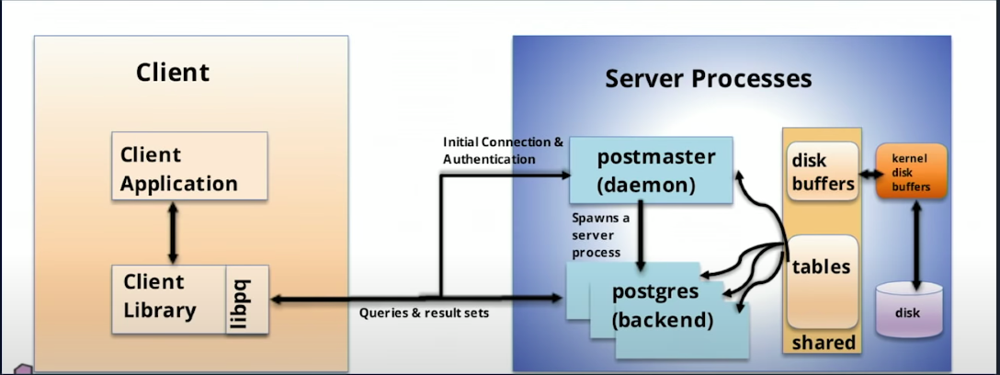
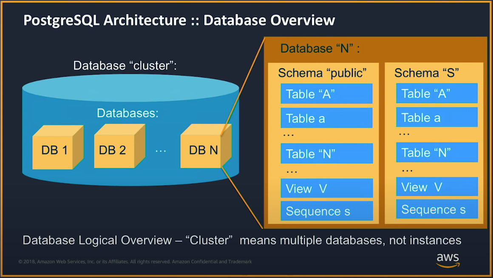
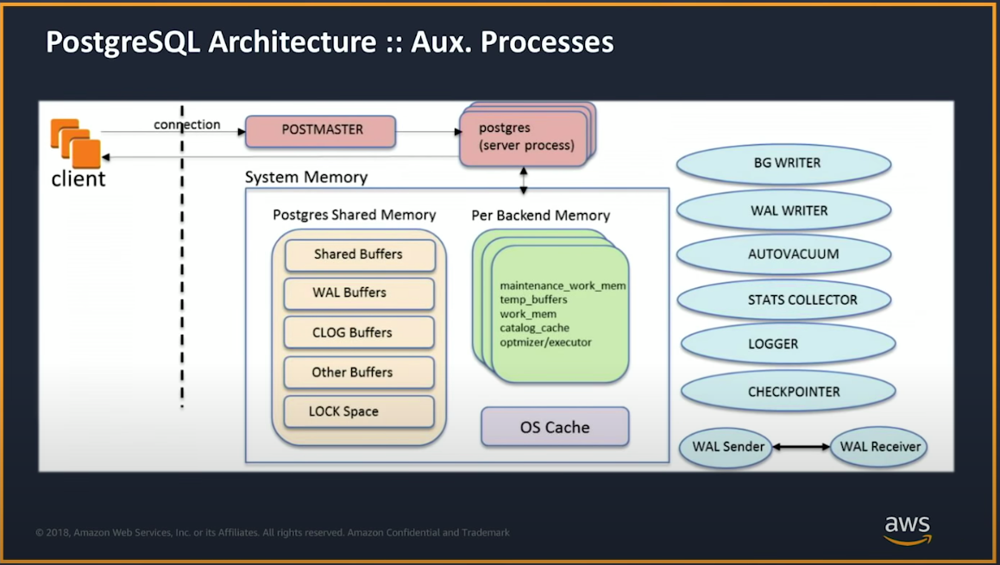

# pgnotes

### Setting up pgadmin4
Create a directory for the configs:
```bash
mkdir $HOME/pgadmin
chmod 777 $HOME/pgadmin/
```
```bash
docker run -p 8080:80 -e 'PGADMIN_DEFAULT_EMAIL=user@domain.com' -e 'PGADMIN_DEFAULT_PASSWORD=SuperSecret' -v $HOME/pgadmin:/var/lib/pgadmin dpage/pgadmin4
```
Go to `localhost:8080` and login to the with `user@domain.com` and
`SuperSecret`.

`-v $HOME/pgadmin:/var/lib/pgadmin` persists server configs 
between different runs of pgadmin.


### Extension setup

```sql
SELECT * FROM pg_available_extensions;
```
To install `uuid-ossp` extension:
```sql
CREATE EXTENSION IF NOT EXISTS "uuid-ossp";
```

Checking if the extension is installed:
```sql
SELECT * FROM pg_extension WHERE extname = 'uuid-ossp';
```

### Creating and populating a table

```sql
CREATE TABLE IF NOT EXISTS people
(
    id
        bigint,
    name
        text,
    unique_id
        uuid
);
INSERT INTO people
SELECT generate_series(1, 100),
       get_random_name(),
       uuid_generate_v4()
```
Where ` get_random_number ` is defined like:

```sql
CREATE
    OR REPLACE FUNCTION random_between(low INT, high INT)
    RETURNS INT AS
$$
BEGIN
    RETURN floor(random() * (high - low + 1) + low);
END;
$$
    language 'plpgsql' STRICT;


CREATE
    OR REPLACE FUNCTION get_random_name()
    RETURNS TEXT AS
$body$
declare
    arr1 text[] := array ['Aaren','Aarika','Abagael','Abagail','Abbe','Abbey','Abbi','Abbie','Abby','Abbye','Abigael','Abigail','Abigale','Abra','Ada','Adah','Adaline','Adan','Adara','Adda','Addi','Addia','Addie','Addy','Adel','Adela'];
    arr2
         text[] := array ['Katleen','Katlin','Kato','Katonah','Katrina','Katrine','Katrinka','Katsuyama','Katt','Katti','Kattie','Katuscha','Katusha','Katushka','Katy','Katya','Katz','Katzen','Katzir','Katzman','Kauffman'];
begin
    RETURN arr1[random_between(1, array_upper(arr1, 1))] || ' ' || arr2[random_between(1, array_upper(arr2, 1))];
end;
$body$
    language 'plpgsql' STRICT;

CREATE
    OR REPLACE FUNCTION get_random_names(num int)
    RETURNS TABLE
            (
                full_name text
            )
AS
$$
declare
    t int;
BEGIN
    RETURN QUERY SELECT n.name FROM (SELECT get_random_name() AS name, generate_series(1, num) AS idx) AS n;
END;
$$
    language 'plpgsql' STRICT;
```


## Getting logs from Postgres RDS instance
With an RDS instance named `mydb`:
```bash
aws rds describe-db-log-files --db-instance-identifier mydb --output text | cut -f 3
```

To store logs in a file called `pglogs.txt` in the current directory:
```bash
for filename in $(aws rds describe-db-log-files --db-instance-identifier mydb --output text | cut -f 3)
do
echo $filename
aws rds download-db-log-file-portion --db-instance-identifier mydb --output text --no-paginate --log-file $filename >> ./pglogs.txt
done
```


## Using pgbadger for log analysis
Given that the `log_line_prefix` for RDS instances is `%t:%r:%u@%d:[%p]:` with a log 
file `pglogs.txt` downloaded from AWS rds, the following line provides 
pgbadger report in `pg.html`:
```bash
pgbadger -f stderr -p '%t:%r:%u@%d:[%p]:' ./pglogs.txt -o pg.html
```


## Low Level Concepts 
Checking which processes are running by postgres:
```bash
ps ef --forest -C postgres
```
Each connection has a new porcess associated to it.

If we connect to a database via `psql`:
```
lsof | grep "localhost:postgres"
```
Shows that there are three processes on the network, from psql to server, its reverse from server to psql, and another one listening.

For seeing the tcp connection flow contents between local `psql` and local server:
```bash
tcpflow -D -c port 5433 -i lo
```
### Steps of query execution
The steps of a query execution are as follows:
- Parse/Analyze
- Rewrite
- Plan/Optimize
- Execute

To see parse step results:
```psql
postgres=# set debug_print_parse to true;
```
However, we need the minimum [log level of client](https://www.postgresql.org/docs/9.5/runtime-config-logging.html) to be `log`:
```psql
postgres=# show client_min_messages;
postgres=# set client_min_messages to log;
```
After setting these values each query's parse tree can be seen.


To see rewrite steps:
```
postgres=# set debug_print_parse to true;
```
In rewrite step, views are transformed to subqueries.

To see plan steps:
```psql
postgres=# set debug_print_plan to true;
```
But a more human-readable plan can be seen using `EXPLAIN` before the query.


## AWS In Depth Training

Based on [this](https://www.youtube.com/watch?v=ysG3x2QOu0c&t=774s)

### Connection Establishment
Steps of connection establishment:

* The client attempts to establish a connection
* A new server process is forked
* The client authenticates with the process and terminates if unsuccessful
* From this step the new process is responsible for the connection
* The integration and communication between processes is done using shared memory

  
Note: Cluster is used interchangeably as DB instance in postgres community

### Disk layout
- Databases are stored separately from each other (tables cannot be joined unless using dblink)
- Each database might have multiple schemas, joins between tables of different schemas is possible
- Internally on the host, each database has a separte directory to store its files


  

#### Parser
* Lexical analysis based on *bison* and *flex* libraries
* Generates the parse tree
* Checks if table and columns (database objects referred in the query) actually exist
* Rewrite happens (e.g. views are replaced with the original query generating them) - rewrite can be tweaked but not recommended

#### Optimizer

At this step the backend knows that the objects exist and the query is valid. At this point, postgres
has to decide which method to use for executing the query (e.g. join, seq scan, index).

It needs the parse tree, table statistics (obtained from analyzing the table or autovacuum), 
and the cost parameters. The output is an execution plan that can be seen via `EXPLAIN`. `EXPLAIN ANALYZE` returns real data
after a real execution.

Note: It is good practice to add `EXPLAIN ANALYZE` outputs to our tests.


#### Executor

Is responsible for the actual execution of the query based on the plan. The plan tree is copied to
state tree for tracking the steps of the execution.

Execution operations should be aware of the *memory* and 
*Transactions*.

For accessing the data different access methods exist (for indexes, tuples) 


### Auxiliary Processes
Everything other than the backends that handle the connections
* Autovacuum
* Stats collector gathers the statistics about the activities, the frequency of table access, number of dead rows, etc.
* WAL writer writes contents of the wal buffers to the WAL files
* ETC (TODO)


### Memory structures of Auxiliary Processes

